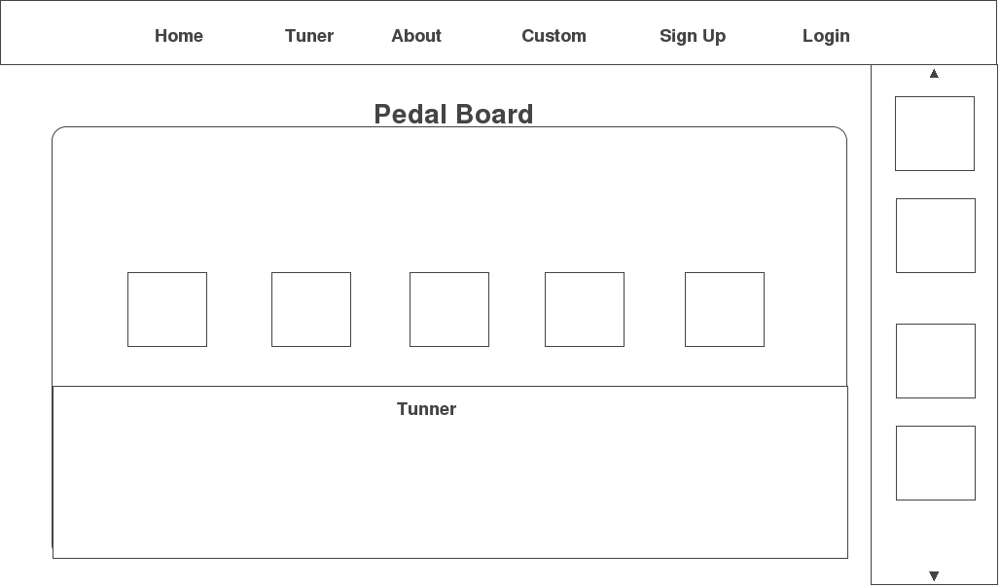

##Summary 

This app gives users the ability to create custom guitar effects without the need on any hardware. Users are able to login via SoundCloud and save recordings directly to their Soundcloud profile. This site also has a social aspect to it, users can post, comment and vote on their favorite tracks, as well as sharing their customized pedalboards with other users. 

## Technology
- [W3C Web Audio API](https://developer.mozilla.org/en-US/docs/Web/API/Web_Audio_API): Used for  analysis of choosen audio sources, add effects to audio, create audio visualizations.
 - [Soundcloud API](https://developers.soundcloud.com/docs/api/guide): Sign in with soundcloud, upload sounds, play songs from soundcloud db. 
 - [CreateJS](http://www.createjs.com/): Soundjs and EaselJS will be used for audio visualization. 
 - [Meteor](https://www.meteor.com/) Javascript Framework
 - MongoDB: Database
 - AngularJs: Frontend
 - SendGrid: Email
 
 
##Wireframe

